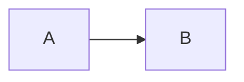

# Best Practices — Mermaid

← [02-diagram-types](02-diagram-types.md) | [README](README.md)

---

## Limites por tipo

Cuando un diagrama supera estos limites, la legibilidad cae drasticamente.
Partir en multiples archivos `.mmd` es la solucion correcta.

| Tipo | Maximo recomendado | Solucion si se supera |
|------|-------------------|----------------------|
| `erDiagram` | ~20 entidades | Partir por dominio (products, orders, accounts) |
| `flowchart` (sin ELK) | ~15 nodos | Activar ELK renderer o partir en sub-flows |
| `flowchart` (con ELK) | ~40 nodos | Partir en sub-flows con referencias |
| `sequenceDiagram` | ~8 participantes | Partir por escenario (happy path, error path) |
| C4Context | ~12 sistemas | Usar C4Container para el detalle interno |
| C4Container | ~10 contenedores por boundary | Usar C4Component para el detalle |

### Cuando usar ELK renderer

```
%%{init: {"flowchart": {"defaultRenderer": "elk"}}}%%
flowchart TD
    ...
```

Activar cuando el flowchart tiene mas de 15 nodos o cuando el layout automatico
produce cruces excesivos de flechas.

---

## Errores comunes al generar con LLMs

| Error | Causa | Solucion |
|-------|-------|----------|
| `Parse error on line N` con nodo llamado `end` | `end` es keyword reservada | Renombrar a `END`, `fin`, o `terminar` |
| `Parse error on line N` con nodo que empieza en `o` o `x` | Confundidos con edge types `o--` y `x--` | Agregar comillas: `A["ok"]` o cambiar nombre |
| Cardinalidades sin guion (`\|\| o{` en vez de `\|\|--o{`) | El `--` o `..` entre las cardinalidades es obligatorio | Verificar siempre la estructura: `LEFT--RIGHT` |
| Parentesis en label sin escapar | El parser confunde `()` con shapes | Usar comillas: `A["texto (con parens)"]` |
| Tildes y caracteres especiales en labels | El parser falla silenciosamente | Usar equivalentes sin acento o escapar con comillas |
| `architecture` sin `-beta` | En Mermaid v11+, `architecture` sin `-beta` no existe | Usar `architecture-beta` o preferir C4Context/graph |
| Mezclar tipos en un archivo | Mermaid solo procesa el primer tipo encontrado | Un tipo por archivo `.mmd` |
| `subgraph` con `direction` que se ignora | Si hay links externos al subgraph, la `direction` interna se ignora | Aceptarlo o restructurar el diagrama |
| Labels con `"` dentro de string | Conflicto de comillas | Usar comillas simples dentro: `A["texto 'con' comillas"]` |
| Flechas invalidas para el tipo de diagrama | Cada tipo tiene su propio set de flechas | Ver tabla de flechas en 01-syntax-reference |

### Caracteres que SIEMPRE deben ir entre comillas en labels

```
flowchart TD
    A["texto (con parentesis)"]
    B["texto: con dos puntos"]
    C["texto, con coma"]
    D["texto con 'comillas simples'"]
    E["texto con acento: árbol"]
```

---

## Nomenclatura de archivos

Todos los archivos `.mmd` van en `docs/diagrams/` del root del proyecto.

### Convencion: `<tipo>-<descripcion>.mmd`

| Tipo de diagrama | Prefijo | Ejemplo |
|-----------------|---------|---------|
| Entity-Relationship | `er-` | `er-product-models.mmd` |
| Flowchart | `flow-` | `flow-order-pipeline.mmd` |
| Architecture | `arch-` | `arch-docker-services.mmd` |
| Sequence | `seq-` | `seq-api-call.mmd` |

### Reglas de nombre

- Kebab-case obligatorio: `er-generation-models` NO `er_generation_models`
- Sin acentos ni caracteres especiales
- Descripcion concisa (2-4 palabras)
- Si hay multiples partes: `er-generation-models-part1.mmd`, `er-generation-models-part2.mmd`

---

## Integracion con el proyecto

### GitHub

GitHub renderiza automaticamente archivos `.mmd` embebidos en markdown:

```markdown
# Arquitectura

El siguiente diagrama muestra los servicios:


```

Para archivos `.mmd` independientes, GitHub muestra el codigo fuente (no renderiza).
Embeber en README.md usando bloques de codigo con lenguaje `mermaid` para visualizacion.

### VS Code

Extension recomendada: **Markdown Preview Mermaid Support**

- ID: `bierner.markdown-mermaid`
- Renderiza diagramas Mermaid en el preview de `.md`
- Para archivos `.mmd` directos, no renderiza — usar en bloques de codigo dentro de `.md`

Extension alternativa: **Mermaid Chart** (oficial de MermaidChart)

- ID: `MermaidChart.vscode-mermaid-chart`
- Requiere cuenta en mermaidchart.com

### MCP claude-mermaid

El proyecto tiene configurado el MCP `claude-mermaid` en `.claude/settings.local.json`.
Permite preview live en browser mientras Claude edita archivos `.mmd`.

El MCP se activa automaticamente cuando Claude Code trabaja con archivos Mermaid.

### mermaid.live

Para debug rapido y prototipado: [https://mermaid.live](https://mermaid.live)

- Editor online con preview en tiempo real
- Exporta PNG, SVG
- Compartir via URL
- Util para validar sintaxis antes de guardar al proyecto

---

## Buenas practicas generales

### Legibilidad

- Preferir `flowchart LR` para pipelines lineales de izquierda a derecha
- Preferir `flowchart TD` para arboles de decision o jerarquias
- En `erDiagram`, incluir solo los atributos relevantes (no todos los campos)
- En `sequenceDiagram`, usar `autonumber` cuando hay mas de 5 mensajes

### Mantenibilidad

- Un diagrama por concepto, no un "mega-diagrama" de todo el sistema
- Actualizar el `.mmd` cuando cambian los modelos o flujos
- Si el skill de Mermaid crea un ER, debe leer los `models.py` actuales para estar sincronizado
- Nombrar participantes con aliases descriptivos en `sequenceDiagram`

### Consistencia visual

- Usar `classDef` en flowcharts para dar color a grupos de nodos relacionados
- En architecture, usar C4Context para vista de alto nivel y C4Container para detalle
- Usar siempre el mismo tema (default recomendado para documentacion del proyecto)

---

← [02-diagram-types](02-diagram-types.md) | [README](README.md)
